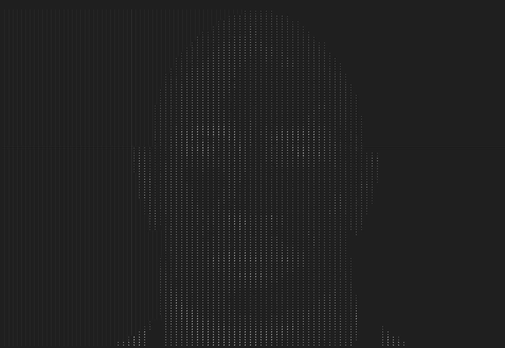

## ASCII art generator

**To convert the image run:**<br>
```console
python3 main.py
```

**Then, enter the image path:**<br>
```console
Path to image: <your path here>
```

**Then, enter the scale factor**<br>
```console
Scale factor in %: <your scale factor here>
```

**Original**<br>
<br>

**Text**<br>

